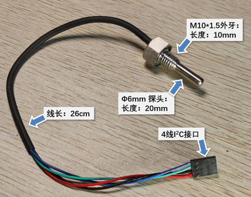
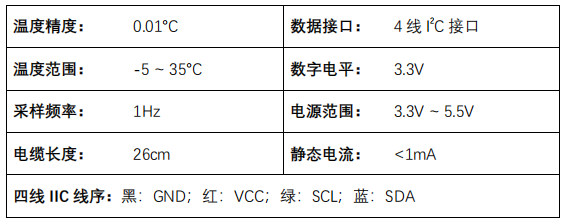

<!--
 Copyright (C) 2024 wwhai

 This program is free software: you can redistribute it and/or modify
 it under the terms of the GNU Affero General Public License as
 published by the Free Software Foundation, either version 3 of the
 License, or (at your option) any later version.

 This program is distributed in the hope that it will be useful,
 but WITHOUT ANY WARRANTY; without even the implied warranty of
 MERCHANTABILITY or FITNESS FOR A PARTICULAR PURPOSE.  See the
 GNU Affero General Public License for more details.

 You should have received a copy of the GNU Affero General Public License
 along with this program.  If not, see <https://www.gnu.org/licenses/>.
-->

# MOTY-Mini Temperature Sensor Library

## Overview
MOTY-mini 型温度传感器是一款高精度直读式温度传感器，其具有精度高、
数字信号输出、结构紧凑、密封防水的特点，适合海洋现场水温测量，可集成于
小型海洋浮标等设备。


## Usage
### Example Code:

```cpp

#include <Wire.h>
#include "MOTYMini.h"

MOTYMiniTempSensor sensor;

void setup() {
  Serial.begin(9600);
  Wire.begin();
  sensor.Init(0x77);
}

void loop() {
  Serial.println(sensor.Temperature(), 4);
  delay(10);
}

```